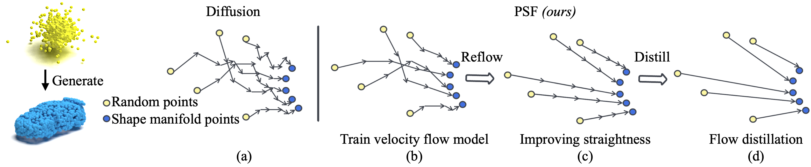

# PSF
[paper](https://arxiv.org/abs/2212.01747)
This is official code of
> **[Fast Point Cloud Generation with Straight Flows](https://arxiv.org/abs/2212.01747)** \
> Lemeng Wu, Dilin Wang, Chengyue Gong, Xingchao Liu, Yunyang Xiong, Rakesh Ranjan, Raghuraman Krishnamoorthi, Vikas Chandra, Qiang Liu

<p align="center">
  
</p>

## About This Code:
Now we release code for training and inference. Pretrained checkpoint work in progress.

# Requirements:
This code is largely build based on [PVD](https://github.com/alexzhou907/PVD).
Make sure at least the following environments are installed (newer version may also works, we test in the below environments).

```
python==3.8
pytorch==1.4.0
torchvision==0.5.0
cudatoolkit==10.1
matplotlib==2.2.5
tqdm==4.32.1
open3d==0.9.0
trimesh=3.7.12
scipy==1.5.1
```

We also need to install pytorch3D for Chamfer Distance Loss, we recommend to follow the offical
install guideline [here](https://github.com/facebookresearch/pytorch3d/blob/main/INSTALL.md)

Install PyTorchEMD by
```
cd metrics/PyTorchEMD
python setup.py install
cp build/**/emd_cuda.cpython-36m-x86_64-linux-gnu.so .
```


## Data

We use the data follow PVD and PointFlow, which can be downloaded [here](https://github.com/stevenygd/PointFlow). Extract and put the data in ./data/ folder/


## Train:

First Stage, train the flow model. We do not add EMA here for a simple and quick converge as illustration.
```bash
$ python train_flow.py --category car|chair|airplane
```
Assume the checkpoint is saved as flow_checkpoint.pth (you can find it in the ./output/train_flow/ )

Second Stage, straight the flow, first sample the data pairs. We provide a single GPU version, in practice, we use
multiGPU to speed up, it needs some file operator and we do not clean it up yet.

```bash
$ python train_flow.py --category car|chair|airplane --model flow_checkpoint.pth
```
Then run the reflow procedure:

```bash
$ python train_reflow.py --category car|chair|airplane --model flow_checkpoint.pth
```
Assume the checkpoint is saved as reflow_checkpoint.pth (you can find it in the ./output/train_reflow/ )

Third Stage, distill the flow.
```bash
$ python train_distill.py --category car|chair|airplane --model reflow_checkpoint.pth
```

Assume the checkpoint is saved as distill_checkpoint.pth (you can find it in the ./output/train_distill/ )


## Test:

```bash
$ python test_flow.py --category car|chair|airplane --model {flow|reflow|distill}_checkpoint.pth --step 1|20|50|100|500|1000
```

You can adjust the step in this test code. For flow, reflow model, we can still expect a good few-step generation.

## Reference

```
@InProceedings{Wu_2023_CVPR,
    author    = {Wu, Lemeng and Wang, Dilin and Gong, Chengyue and Liu, Xingchao and Xiong, Yunyang and Ranjan, Rakesh and Krishnamoorthi, Raghuraman and Chandra, Vikas and Liu, Qiang},
    title     = {Fast Point Cloud Generation With Straight Flows},
    booktitle = {Proceedings of the IEEE/CVF Conference on Computer Vision and Pattern Recognition (CVPR)},
    month     = {June},
    year      = {2023},
    pages     = {9445-9454}
}
```

## Acknowledgement:
This code is built based on [PVD](https://github.com/alexzhou907/PVD), thank for their great code repo!
